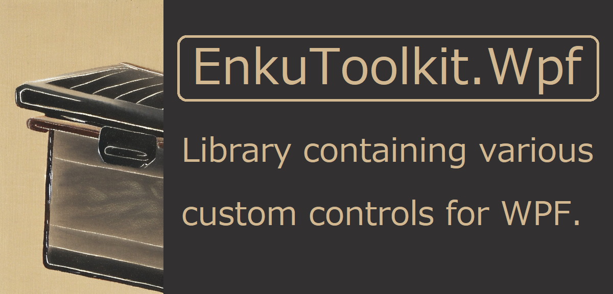

  

[Documentation](https://stdenku.github.io/EnkuToolkit.Wpf/articles/intro.html)

[Api reference](https://stdenku.github.io/EnkuToolkit.Wpf/api/index.html)

[Examples](https://github.com/StdEnku/EnkuToolkit.Wpf/tree/main/Examples)

# Summary

This library is an MIT-licensed OSS library that includes features that <br/>the author felt were missing from the standard WPF functionality.

Specifically, it includes the following features

- Custom controls
- Unique animation effect mechanism
- Attached behaviors to extend existing controls
- Value converters
- MarkupExtensions
- ViewServices

# Explanation of the two assemblies

 : [NuGet Gallery | EnkuToolkit.Wpf](https://www.nuget.org/packages/EnkuToolkit.Wpf)<br/>
 : [NuGet Gallery | EnkuToolkit.UiIndependent](https://www.nuget.org/packages/EnkuToolkit.UiIndependent)<br/>

This library consists of two assemblies:<br/>EnkuToolkit.Wpf, which depends on the WPF assembly, and EnkuToolkit.UiIndependent, <br/>which can be called from ViewModel and does not depend on the WPF assembly.

When installing from Nuget, please note the following

If you want to manage View and ViewModel in the same project, <br/>install only EnkuToolkit.Wpf from Nuget because EnkuToolkit.Wpf <br/>depends on EnkuToolkit.UiIndependent.

If you want to manage View and ViewModel in different projects, <br/>install EnkuToolkit.Wpf in the project for View and EnkuToolkit.UiIndependent <br/>in the project for ViewModel.

# To call classes in this library from xaml

To access the classes of this library from xaml, use the following xml namespace.

> ```xaml
> xmlns:et="https://github.com/StdEnku/EnkuToolkit"
> ```
