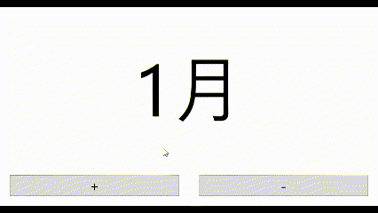
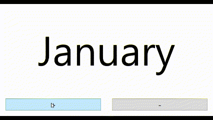

# Method for changing integers from 1~12 to the name of the month using a converter

This library implements NumberToMonthNameConverter to convert integer values from 1~12 to month names.

This converter determines the name of the month based on the culture information provided in the Binding.ConverterCulture property, so be sure to specify the ConverterCulture value.

An example of its use is shown below.


MainWindow.xaml

```xaml
<Window x:Class="MyApp.MainWindow"
        xmlns="http://schemas.microsoft.com/winfx/2006/xaml/presentation"
        xmlns:x="http://schemas.microsoft.com/winfx/2006/xaml"
        xmlns:d="http://schemas.microsoft.com/expression/blend/2008"
        xmlns:mc="http://schemas.openxmlformats.org/markup-compatibility/2006"
        xmlns:local="clr-namespace:MyApp"
        xmlns:et="https://github.com/StdEnku/EnkuToolkit"
        xmlns:sg="clr-namespace:System.Globalization;assembly=mscorlib"
        mc:Ignorable="d"
        Title="MainWindow" Height="450" Width="800">

    <Window.DataContext>
        <local:MainWindowViewModel />
    </Window.DataContext>

    <DockPanel LastChildFill="True">
        <UniformGrid Columns="2" DockPanel.Dock="Bottom">
            <Button Content="+" Command="{Binding ToNextMonthCommand}" Margin="20" FontSize="30" />
            <Button Content="-" Command="{Binding ToLastMonthCommand}" Margin="20" FontSize="30" />
        </UniformGrid>

        <Viewbox DockPanel.Dock="Top">
            <Label Content="{Binding MonthNum, 
                                     Converter={x:Static et:NumberToMonthNameConverter.Instance}, 
                                     ConverterCulture={x:Static sg:CultureInfo.CurrentCulture}}" />
        </Viewbox>
    </DockPanel>
</Window>
```


MainWindowViewModel.cs

```c#
namespace MyApp;

using System;
using System.ComponentModel;
using System.Windows.Input;

public class MainWindowViewModel : INotifyPropertyChanged
{
    public event PropertyChangedEventHandler? PropertyChanged;

    private int _monthNum = 1;
    public int MonthNum
    {
        get => _monthNum;
        set
        {
            _monthNum = value;
            PropertyChanged?.Invoke(this, new PropertyChangedEventArgs(nameof(MonthNum)));
        }
    }

    public DelegateCommand ToNextMonthCommand { get; }
    private void ToNextMonth(object? param) => MonthNum = MonthNum >= 12 ? 1 : MonthNum + 1;

    public DelegateCommand ToLastMonthCommand { get; }
    private void ToLastMonth(object? param) => MonthNum = MonthNum <= 1 ? 12 : MonthNum - 1;

    public MainWindowViewModel()
    {
        ToNextMonthCommand = new(ToNextMonth);
        ToLastMonthCommand = new(ToLastMonth);
    }
}

#region MVVM util
public class DelegateCommand : ICommand
{
    private Action<object?> _execute;
    private Func<object?, bool> _canExecute;

    public DelegateCommand(Action<object?> execute, Func<object?, bool>? canExecute = null)
    {
        _execute = execute;
        _canExecute = canExecute ?? (x => true);
    }

    public void RaiseCanExecuteChanged()
    {
        var functor = CanExecuteChanged;
        functor?.Invoke(this, EventArgs.Empty);
    }

    public event EventHandler? CanExecuteChanged;

    public bool CanExecute(object? parameter) => _canExecute(parameter);

    public void Execute(object? parameter) => _execute(parameter);
}
#endregion
```

Result

In this example, ClutureInfo.CurrentCluture is specified in the Binding.ConverterCulture property, so it is displayed in Japanese, which is my execution environment.





実行環境に依存しない言語を指定したい場合は、以下のように記述してください。

```xaml
<Label Content="{Binding MonthNum, 
                 Converter={x:Static et:NumberToMonthNameConverter.Instance}, 
                 ConverterCulture=en}" />
```


