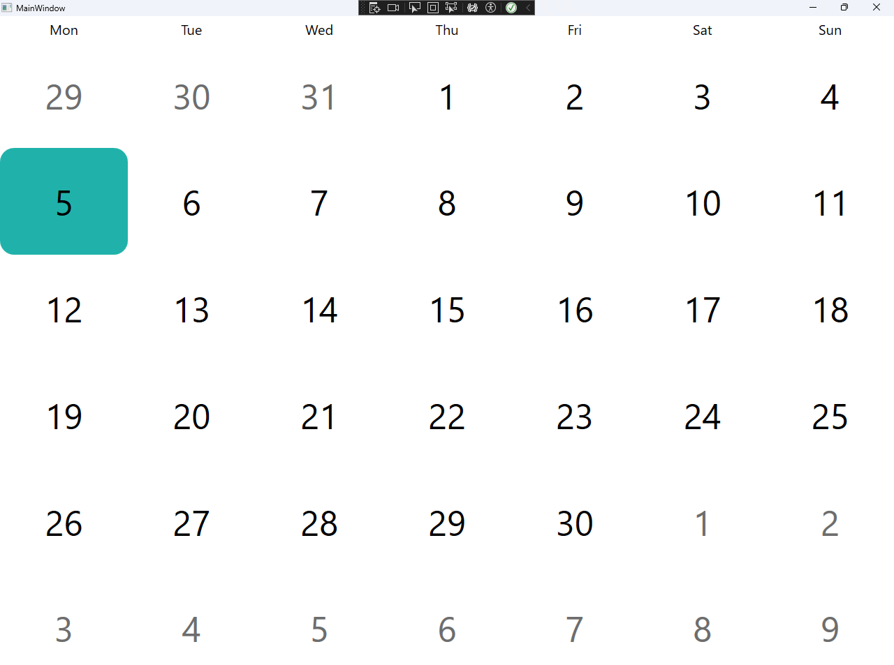
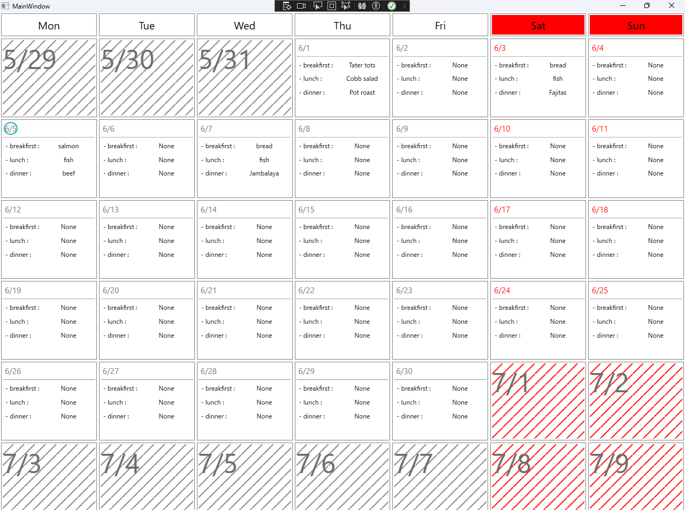

# Create a calendar with customizable cell internals using CustomizableCalendar

CustomizableCalendarコントロールとは通常のCalendarコントロールとは違い、

セルの内部を自由にカスタマイズできるカレンダーコントロールです。

[カスタマイズ前の画像]

[カスタマイズ後の画像]

## 表示したいYearやMonthを指定する方法

CustomizableCalendarにはWPFに標準搭載されているカレンダーのようにボタンやYear/Month表示欄はありません。これは表示したい年と月をを指定する際に
