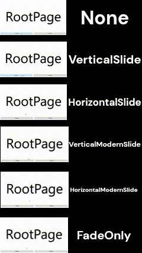
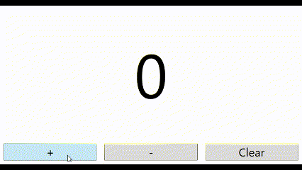

# Execute effects when the display state changes

For example, if you have created a counter, you may want to execute an effect when the count-up or count-down button is clicked and the state on the screen changes.
For such cases, a class called TransitionEffectContentControl exists in this library.
This class can be used in the same way as a normal ContentControl, but it has the following members that are not present in ContentControl,

- Snapshot method - method to hold a bitmap of the display state before a change
- RunForwardEffect method - method for running forward effects
- RunBackwardEffect method - method for executing a backward effect
- RunReloadEffect method - method for executing effects for reloading
- TransitionEffect property - property for specifying the type of effect to execute
- IsCompleted property - Property of type bool that is True when no effect is running
- ForwardStoryboard property - property for specifying custom forward effects (Custom effects are described below.)
- BackwardStoryboard property - property for specifying custom backward effects (Custom effects are described below.)
- ReloadStoryboard property - property for specifying effects for custom reloads (Custom effects are described below.)
- SnapshotDpiX property - property for specifying the horizontal DPI value of the bitmap when imaging the state before the change
- SnapshotDpiY property - property for specifying the vertical DPI value of the bitmap when imaging the state before the change


The basic usage is after specifying the type of effect you want to execute by specifying the TransitionEffect property during initialization, etc,
Immediately before the screen state changes, the Snapshot method is executed to record an image of the current screen state,
Then, the Snapshot method is executed immediately before the screen state changes to record an image of the current screen state, and the effect execution method is executed immediately after the screen state changes. This is the flow.


Also, since it is uncomfortable to execute another effect while the effect is running, it is recommended to lock the effect while it is running by binding the IsEnabled property or IsHitTestVisible property, which is a member of the button or other control that triggers the effect execution, and the IsCompleted property, which is a member of the TranSitionEffectContentControl.


The type of TransitionEffect is EnkuToolkit.Wpf.Constants.TransitionEffects, which is an
Enum value and has the following members

- None : Do not run effects
- HorizontalSlide : Perform horizontal sliding effects
- VerticalSlide : Perform vertical sliding effects
- HorizontalModernSlide : Perform modern sliding effects in horizontal direction
- VerticalModernSlide : Perform modern vertical sliding effects
- FadeOnly : Execute feed effects
- Custom : Value for executing custom effects as described below.

Also note that the initial value of TransitionEffect is None.



## Simple sample code

MainWindow.xaml

``` Xaml
<Window ~Ellipsis~
        xmlns:et="https://github.com/StdEnku/EnkuToolkit">

    <DockPanel LastChildFill="True">
        <UniformGrid Columns="3" DockPanel.Dock="Bottom" IsEnabled="{Binding ElementName=transitionEffect, Path=IsCompleted}">
            <Button Content="+" Margin="10" FontSize="30" Click="PlusButtonClicked" />
            <Button Content="-" Margin="10" FontSize="30" Click="MinusButtonClicked" />
            <Button Content="Clear" Margin="10" FontSize="30" Click="ClearButtonClicked" />
        </UniformGrid>

        <et:TransitionEffectContentControl Name="transitionEffect" DockPanel.Dock="Top" TransitionEffect="VerticalSlide">
            <Viewbox>
                <Label Content="0" Name="label" />
            </Viewbox>
        </et:TransitionEffectContentControl>
    </DockPanel>
</Window>
```


MainWindow.xaml.cs

```c#
namespace MyApp;

using System.Diagnostics;
using System.Reflection;
using System.Windows;
using System.Windows.Controls;

public partial class MainWindow : Window
{
    private int _count;

    public MainWindow()
    {
        InitializeComponent();
    }

    private void PlusButtonClicked(object sender, RoutedEventArgs e)
    {
        _count++;
        transitionEffect.Snapshot(); //Snapshot taken before screen update
        label.Content = _count;
        transitionEffect.RunForwardEffect(); //Effect execution after screen refresh
    }

    private void MinusButtonClicked(object sender, RoutedEventArgs e)
    {
        _count--;
        transitionEffect.Snapshot(); //Snapshot taken before screen update
        label.Content = _count;
        transitionEffect.RunBackwardEffect(); //Effect execution after screen refresh
    }

    private void ClearButtonClicked(object sender, RoutedEventArgs e)
    {
        _count = 0;
        transitionEffect.Snapshot(); //Snapshot taken before screen update
        label.Content = _count;
        transitionEffect.RunReloadEffect(); //Effect execution after screen refresh
    }
}
```

Result



## Explanation of Custom Effects

### How to specify custom effects

To execute a custom effect, set the TransitionEffect to Custom.
To execute a custom effect, specify Custom for TransitionEffect and set the following three properties of the Storyboard type.

- ForwardStoryboard
- BackwardStoryboar
- ReloadStoryboard

It is not necessary to specify all of the above properties; if they are null, nothing will happen when the corresponding effect is executed.

### Description of Storyboard that can be specified for custom effects

Inside an TransitionEffectContentControl, there is a TransformContentControl called contentTc that displays the transition destination state and a TransformContentControl called imageTc that displays the state before the transition, so specify a storyboard that contains the animation to transform them.
An example is given below.

MainWindow.xaml

``` Xaml
<Window ~Ellipsis~
        xmlns:et="https://github.com/StdEnku/EnkuToolkit">

    <DockPanel LastChildFill="True">
        <UniformGrid Columns="3" DockPanel.Dock="Bottom" IsEnabled="{Binding ElementName=transitionEffect, Path=IsCompleted}">
            <Button Content="+" Margin="10" FontSize="30" Click="PlusButtonClicked" />
            <Button Content="-" Margin="10" FontSize="30" Click="MinusButtonClicked" />
            <Button Content="Clear" Margin="10" FontSize="30" Click="ClearButtonClicked" />
        </UniformGrid>

        <et:TransitionEffectContentControl Name="transitionEffect" DockPanel.Dock="Top" TransitionEffect="VerticalSlide">
            <Viewbox>
                <Label Content="0" Name="label" />
            </Viewbox>
            
            <et:TransitionEffectContentControl.ForwardStoryboard>
                <Storyboard>
                    <DoubleAnimationUsingKeyFrames 
                    Storyboard.TargetName="contentTc"
                    Storyboard.TargetProperty="(et:TransformContentControl.RotateAngle)"
                    FillBehavior="Stop">

                        <LinearDoubleKeyFrame KeyTime="0:0:0.0" Value="0.5" />
                        <LinearDoubleKeyFrame KeyTime="0:0:0.2" Value="0.5" />
                        <LinearDoubleKeyFrame KeyTime="0:0:0.4" Value="1.0" />
                    </DoubleAnimationUsingKeyFrames>

                    <DoubleAnimationUsingKeyFrames 
                    Storyboard.TargetName="imageTc"
                    Storyboard.TargetProperty="(et:TransformContentControl.RotateAngle)"
                    FillBehavior="Stop">

                        <LinearDoubleKeyFrame KeyTime="0:0:0.0" Value="0.0" />
                        <LinearDoubleKeyFrame KeyTime="0:0:0.2" Value="0.5" />
                        <LinearDoubleKeyFrame KeyTime="0:0:0.4" Value="0.5" />
                    </DoubleAnimationUsingKeyFrames>

                    <DoubleAnimationUsingKeyFrames 
                    Storyboard.TargetName="contentTc"
                    Storyboard.TargetProperty="(et:TransformContentControl.Opacity)"
                    FillBehavior="Stop">

                        <LinearDoubleKeyFrame KeyTime="0:0:0.0" Value="0.0" />
                        <LinearDoubleKeyFrame KeyTime="0:0:0.2" Value="0.0" />
                        <LinearDoubleKeyFrame KeyTime="0:0:0.4" Value="1.0" />
                    </DoubleAnimationUsingKeyFrames>

                    <DoubleAnimationUsingKeyFrames 
                    Storyboard.TargetName="imageTc"
                    Storyboard.TargetProperty="(et:TransformContentControl.Opacity)"
                    FillBehavior="Stop">

                        <LinearDoubleKeyFrame KeyTime="0:0:0.0" Value="1.0" />
                        <LinearDoubleKeyFrame KeyTime="0:0:0.2" Value="0.0" />
                        <LinearDoubleKeyFrame KeyTime="0:0:0.4" Value="0.0" />
                    </DoubleAnimationUsingKeyFrames>
                </Storyboard>
            </et:TransitionEffectContentControl.ForwardStoryboard>

            <et:TransitionEffectContentControl.BackwardStoryboard>
                <Storyboard>
                    <DoubleAnimationUsingKeyFrames 
                    Storyboard.TargetName="contentTc"
                    Storyboard.TargetProperty="(et:TransformContentControl.RotateAngle)"
                    FillBehavior="Stop">

                        <LinearDoubleKeyFrame KeyTime="0:0:0.0" Value="-0.5" />
                        <LinearDoubleKeyFrame KeyTime="0:0:0.2" Value="-0.5" />
                        <LinearDoubleKeyFrame KeyTime="0:0:0.4" Value="-1.0" />
                    </DoubleAnimationUsingKeyFrames>

                    <DoubleAnimationUsingKeyFrames 
                    Storyboard.TargetName="imageTc"
                    Storyboard.TargetProperty="(et:TransformContentControl.RotateAngle)"
                    FillBehavior="Stop">

                        <LinearDoubleKeyFrame KeyTime="0:0:0.0" Value="0.0" />
                        <LinearDoubleKeyFrame KeyTime="0:0:0.2" Value="-0.5" />
                        <LinearDoubleKeyFrame KeyTime="0:0:0.4" Value="-0.5" />
                    </DoubleAnimationUsingKeyFrames>

                    <DoubleAnimationUsingKeyFrames 
                    Storyboard.TargetName="contentTc"
                    Storyboard.TargetProperty="(et:TransformContentControl.Opacity)"
                    FillBehavior="Stop">

                        <LinearDoubleKeyFrame KeyTime="0:0:0.0" Value="0.0" />
                        <LinearDoubleKeyFrame KeyTime="0:0:0.2" Value="0.0" />
                        <LinearDoubleKeyFrame KeyTime="0:0:0.4" Value="1.0" />
                    </DoubleAnimationUsingKeyFrames>

                    <DoubleAnimationUsingKeyFrames 
                    Storyboard.TargetName="imageTc"
                    Storyboard.TargetProperty="(et:TransformContentControl.Opacity)"
                    FillBehavior="Stop">

                        <LinearDoubleKeyFrame KeyTime="0:0:0.0" Value="1.0" />
                        <LinearDoubleKeyFrame KeyTime="0:0:0.2" Value="0.0" />
                        <LinearDoubleKeyFrame KeyTime="0:0:0.4" Value="0.0" />
                    </DoubleAnimationUsingKeyFrames>
                </Storyboard>
            </et:TransitionEffectContentControl.BackwardStoryboard>

            <et:TransitionEffectContentControl.ReloadStoryboard>
                <Storyboard>
                    <DoubleAnimationUsingKeyFrames 
                    Storyboard.TargetName="contentTc"
                    Storyboard.TargetProperty="(et:TransformContentControl.ScaleX)"
                    FillBehavior="Stop">

                        <LinearDoubleKeyFrame KeyTime="0:0:0.0" Value="0.0" />
                        <LinearDoubleKeyFrame KeyTime="0:0:0.2" Value="0.0" />
                        <LinearDoubleKeyFrame KeyTime="0:0:0.4" Value="1.0" />
                    </DoubleAnimationUsingKeyFrames>

                    <DoubleAnimationUsingKeyFrames 
                    Storyboard.TargetName="imageTc"
                    Storyboard.TargetProperty="(et:TransformContentControl.ScaleY)"
                    FillBehavior="Stop">

                        <LinearDoubleKeyFrame KeyTime="0:0:0.0" Value="1.0" />
                        <LinearDoubleKeyFrame KeyTime="0:0:0.2" Value="0.0" />
                        <LinearDoubleKeyFrame KeyTime="0:0:0.4" Value="0.0" />
                    </DoubleAnimationUsingKeyFrames>
                    
                    <DoubleAnimationUsingKeyFrames 
                    Storyboard.TargetName="contentTc"
                    Storyboard.TargetProperty="(et:TransformContentControl.Opacity)"
                    FillBehavior="Stop">

                        <LinearDoubleKeyFrame KeyTime="0:0:0.0" Value="0.0" />
                        <LinearDoubleKeyFrame KeyTime="0:0:0.2" Value="0.0" />
                        <LinearDoubleKeyFrame KeyTime="0:0:0.4" Value="1.0" />
                    </DoubleAnimationUsingKeyFrames>

                    <DoubleAnimationUsingKeyFrames 
                    Storyboard.TargetName="imageTc"
                    Storyboard.TargetProperty="(et:TransformContentControl.Opacity)"
                    FillBehavior="Stop">

                        <LinearDoubleKeyFrame KeyTime="0:0:0.0" Value="1.0" />
                        <LinearDoubleKeyFrame KeyTime="0:0:0.2" Value="0.0" />
                        <LinearDoubleKeyFrame KeyTime="0:0:0.4" Value="0.0" />
                    </DoubleAnimationUsingKeyFrames>
                </Storyboard>
            </et:TransitionEffectContentControl.ReloadStoryboard>
        </et:TransitionEffectContentControl>
    </DockPanel>
</Window>
```


MainWindow.xaml.cs

```c#
namespace MyApp;

using System.Diagnostics;
using System.Reflection;
using System.Windows;
using System.Windows.Controls;

public partial class MainWindow : Window
{
    private int _count;

    public MainWindow()
    {
        InitializeComponent();
    }

    private void PlusButtonClicked(object sender, RoutedEventArgs e)
    {
        _count++;
        transitionEffect.Snapshot(); //Snapshot taken before screen update
        label.Content = _count;
        transitionEffect.RunForwardEffect(); //Effect execution after screen refresh
    }

    private void MinusButtonClicked(object sender, RoutedEventArgs e)
    {
        _count--;
        transitionEffect.Snapshot(); //Snapshot taken before screen update
        label.Content = _count;
        transitionEffect.RunBackwardEffect(); //Effect execution after screen refresh
    }

    private void ClearButtonClicked(object sender, RoutedEventArgs e)
    {
        _count = 0;
        transitionEffect.Snapshot(); //Snapshot taken before screen update
        label.Content = _count;
        transitionEffect.RunReloadEffect(); //Effect execution after screen refresh
    }
}
```

Result


