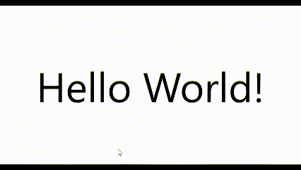

# Eliminate lengthy triggers and actions using ternary operator converters

Changing the background color on mouse-over is usually done using a trigger and action, which can easily become a very long piece of code, as shown below.

```xaml
<Window x:Class="WpfApp1.MainWindow"
        xmlns="http://schemas.microsoft.com/winfx/2006/xaml/presentation"
        xmlns:x="http://schemas.microsoft.com/winfx/2006/xaml"
        xmlns:d="http://schemas.microsoft.com/expression/blend/2008"
        xmlns:mc="http://schemas.openxmlformats.org/markup-compatibility/2006"
        xmlns:et="https://github.com/StdEnku/EnkuToolkit"
        xmlns:local="clr-namespace:WpfApp1"
        mc:Ignorable="d"
        Title="MainWindow" Height="450" Width="800">

    <Viewbox Margin="50">
        <Label Content="Hello World!">
            <Label.Style>
                <Style TargetType="Label">
                    <Style.Triggers>
                        <DataTrigger Binding="{Binding RelativeSource={RelativeSource Mode=Self}, Path=IsMouseOver}" Value="True">
                            <Setter Property="Background" Value="Red" />
                        </DataTrigger>

                        <DataTrigger Binding="{Binding RelativeSource={RelativeSource Mode=Self}, Path=IsMouseOver}" Value="False">
                            <Setter Property="Background" Value="Transparent" />
                        </DataTrigger>
                    </Style.Triggers>
                </Style>
            </Label.Style>
        </Label>
    </Viewbox>
</Window>
```


To solve such problems, this library implements a converter called TernaryOperatorConverter.

The TernaryOperatorConverter has a property named ResultValueIfTrue to specify the value to return if the binding source bool value is True and a property named ResultValueIfFalse to specify the value to return if it is False. property to specify the value to return if false. They are so named because their behavior is similar to that of ternary operators.

```xaml
<Window x:Class="WpfApp1.MainWindow"
        xmlns="http://schemas.microsoft.com/winfx/2006/xaml/presentation"
        xmlns:x="http://schemas.microsoft.com/winfx/2006/xaml"
        xmlns:d="http://schemas.microsoft.com/expression/blend/2008"
        xmlns:mc="http://schemas.openxmlformats.org/markup-compatibility/2006"
        xmlns:et="https://github.com/StdEnku/EnkuToolkit"
        xmlns:local="clr-namespace:WpfApp1"
        mc:Ignorable="d"
        Title="MainWindow" Height="450" Width="800">

    <Window.Resources>
        <et:TernaryOperatorConverter x:Key="MouseOverBackgroundConverter" ResultValueIfTrue="Red" ResultValueIfFalse="Transparent" />
    </Window.Resources>

    <Viewbox Margin="50">
        <Label Content="Hello World!" Background="{Binding RelativeSource={RelativeSource Mode=Self}, Path=IsMouseOver, Converter={StaticResource MouseOverBackgroundConverter}}"/>
    </Viewbox>
</Window>

```


Result

