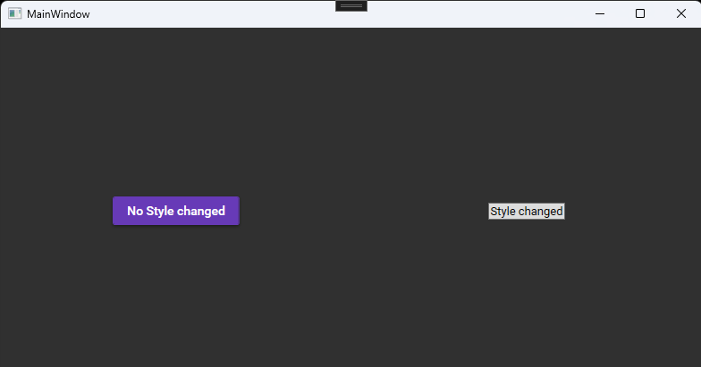

# Retrieve application resources from markup extensions

[MaterialDesignInXAML](https://github.com/MaterialDesignInXAML/MaterialDesignInXamlToolkit)などのアプリケーションリソースを修正することでコントロールの見た目をモダンにするようなライブラリを使用している場合、コントロールのStyleプロパティを変更すると標準の見た目に戻ってしまいます。

```xaml
<UniformGrid Columns="2">
    <Button Content="No Style changed" Margin="30" HorizontalAlignment="Center" VerticalAlignment="Center" />    
        
    <Button Margin="30" HorizontalAlignment="Center" VerticalAlignment="Center">
        <Button.Style>
            <Style TargetType="Button">
            	<Setter Property="Content" Value="Style changed" />
        	</Style>
    	</Button.Style>
	</Button>
</UniformGrid>
```



これはStyleのBasedOnプロパティにアプリケーションのリソースとしてMaterialDesignInXAMLで定義されているボタンのスタイルを指定していないのでこのような結果となります。
このような状況下でアプリケーションのリソースを取得したい場合は本ライブラリにて定義されている
GetApplicationResourceマークアップ拡張を使用してください。

このマークアップ拡張の引数にはコントロールのTypeオブジェクトを使用すればそのアプリケーションリソースとして登録されているコントロールのデフォルトのスタイルを取得できます。

```xaml
<UniformGrid Columns="2">
    <Button Content="No Style changed" Margin="30" HorizontalAlignment="Center" VerticalAlignment="Center" />    
        
    <Button Margin="30" HorizontalAlignment="Center" VerticalAlignment="Center">
        <Button.Style>
            <Style TargetType="Button"  BasedOn="{et:GetApplicationResource {x:Type Button}}">
            	<Setter Property="Content" Value="Style changed" />
        	</Style>
    	</Button.Style>
	</Button>
</UniformGrid>
```


また、StaticResourceマークアップ拡張があるので利用価値があるかわかりませんが
文字列を引数として渡せばその文字列と同じx:Keyで定義されている
アプリケーションリソースとして登録されたオブジェクトを返します。

