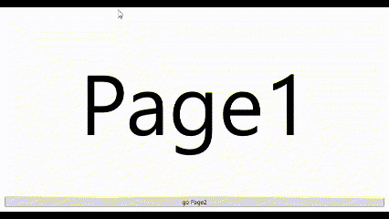

# AnimatedNavigationWindow Class

assembly : EnkuToolkit.Wpf

namespace : EnkuToolkit.Wpf.Controls

## remarks

Extension of NavigationWindow class that enables animation during screen transitions

The basic usage is the same as the NavigationWindow class that comes standard with WPF.

The following CLR properties have been added, which can be used to specify the animation to be executed during screen transitions

The following CLR properties have been added to the NavigationWindow class.

```c#
// When using the standard animations already included in this library
// property for specifying the type of animation to execute during screen transitions.
// If you do not want to use your own animation or do not want to execute an animation
// null.
// Also, the BuiltinAnimTypes type is an enum value.
public BuiltinAnimTypes? BuiltinAnimType { get; set; }
```

```c# 
// Property for specifying animation in Storyboard for self-made forward screen transitions.
// If the above BuiltinAnimType is not null, it is ignored.
// If null is specified, the animation for forward screen transitions is not executed.
public Storyboard? ForwardAnim { get; set; }
```

```c#
// Property for specifying an animation in Storyboard for a home-made reverse screen transition.
// If the above BuiltinAnimType is not null, it is ignored.
// If null is specified, the animation for reverse screen transitions is not executed.
public Storyboard? BackwardAnim { get; set; }
```

Currently, only the following two standard animations are included in this library

- Slidein 
- ModernSlidein

## example

All of the following files should be placed in the root folder of the project.

DefaultPage.xaml


Page1.xaml

```xaml
<Page x:Class="MyApp.Page1"
      xmlns="http://schemas.microsoft.com/winfx/2006/xaml/presentation"
      xmlns:x="http://schemas.microsoft.com/winfx/2006/xaml"
      xmlns:mc="http://schemas.openxmlformats.org/markup-compatibility/2006" 
      xmlns:d="http://schemas.microsoft.com/expression/blend/2008" 
      xmlns:local="clr-namespace:MyApp"
      mc:Ignorable="d" 
      d:DesignHeight="450" d:DesignWidth="800"
      Title="Page1">

    <DockPanel LastChildFill="True">
        <Button Content="go Page2" DockPanel.Dock="Bottom" Margin="10" Click="Button_Click" />

        <Viewbox DockPanel.Dock="Top">
            <Label Content="Page1" />
        </Viewbox>
    </DockPanel>
</Page>
```


Page1.xaml.cs

```csharp
namespace MyApp;

using EnkuToolkit.Wpf.Controls;
using System;
using System.Windows.Controls;

public partial class Page1 : Page
{
    public readonly Uri _baseUri = new Uri("pack://application:,,,/", UriKind.Absolute);

    public Page1()
    {
        InitializeComponent();
    }

    private void Button_Click(object sender, System.Windows.RoutedEventArgs e)
    {
        var anw = (AnimatedNavigationWindow)App.Current.MainWindow;
        var nextUri = new Uri(this._baseUri, "Page2.xaml");
        anw.Navigate(nextUri);
    }
}
```


Page2.xaml

```xaml
<Page x:Class="MyApp.Page2"
      xmlns="http://schemas.microsoft.com/winfx/2006/xaml/presentation"
      xmlns:x="http://schemas.microsoft.com/winfx/2006/xaml"
      xmlns:mc="http://schemas.openxmlformats.org/markup-compatibility/2006" 
      xmlns:d="http://schemas.microsoft.com/expression/blend/2008" 
      xmlns:local="clr-namespace:MyApp"
      mc:Ignorable="d" 
      d:DesignHeight="450" d:DesignWidth="800"
      Title="Page2">

    <DockPanel LastChildFill="True">
        <Button Content="go back" DockPanel.Dock="Bottom" Margin="10" Click="Button_Click" />

        <Viewbox DockPanel.Dock="Top">
            <Label Content="Page2" />
        </Viewbox>
    </DockPanel>
</Page>
```


Page2.xaml.cs

```csharp
namespace MyApp;

using EnkuToolkit.Wpf.Controls;
using System;
using System.Windows.Controls;

public partial class Page2 : Page
{
    public Page2()
    {
        InitializeComponent();
    }

    private void Button_Click(object sender, System.Windows.RoutedEventArgs e)
    {
        var anw = (AnimatedNavigationWindow)App.Current.MainWindow;
        anw.GoBack();
    }
}
```


MainWindow.xaml

```xaml
<et:AnimatedNavigationWindow
        x:Class="MyApp.MainWindow"
        xmlns="http://schemas.microsoft.com/winfx/2006/xaml/presentation"
        xmlns:x="http://schemas.microsoft.com/winfx/2006/xaml"
        xmlns:d="http://schemas.microsoft.com/expression/blend/2008"
        xmlns:mc="http://schemas.openxmlformats.org/markup-compatibility/2006"
        xmlns:local="clr-namespace:MyApp"
        xmlns:et="https://github.com/StdEnku/EnkuToolkit/Wpf/Controls"
        mc:Ignorable="d"
        Title="MainWindow" Height="450" Width="800"
        Source="Page1.xaml"
        BuiltinAnimType="ModernSlidein">
    
</et:AnimatedNavigationWindow>
```


## Example of self-made animation

Modify the MainWindow.xaml of the above sample as follows.

```xaml
<et:AnimatedNavigationWindow
        x:Class="MyApp.MainWindow"
        xmlns="http://schemas.microsoft.com/winfx/2006/xaml/presentation"
        xmlns:x="http://schemas.microsoft.com/winfx/2006/xaml"
        xmlns:d="http://schemas.microsoft.com/expression/blend/2008"
        xmlns:mc="http://schemas.openxmlformats.org/markup-compatibility/2006"
        xmlns:local="clr-namespace:MyApp"
        xmlns:et="https://github.com/StdEnku/EnkuToolkit/Wpf/Controls"
        mc:Ignorable="d"
        Title="MainWindow" Height="450" Width="800"
        Source="Page1.xaml">

    <et:AnimatedNavigationWindow.ForwardAnim>
        <Storyboard>
            <DoubleAnimationUsingKeyFrames BeginTime="0:0:0"
                                       Storyboard.TargetName="CurrentTransform"
                                       Storyboard.TargetProperty="(et:NormalizedTransformContentControl.TranslateY)"
                                       FillBehavior="Stop">

                <DiscreteDoubleKeyFrame KeyTime="0:0:0" Value="1" />
                <EasingDoubleKeyFrame KeyTime="0:0:1" Value="0">
                    <EasingDoubleKeyFrame.EasingFunction>
                        <BounceEase EasingMode="EaseOut" />
                    </EasingDoubleKeyFrame.EasingFunction>
                </EasingDoubleKeyFrame>
            </DoubleAnimationUsingKeyFrames>

            <DoubleAnimationUsingKeyFrames BeginTime="0:0:0"
                                       Storyboard.TargetName="OldTransform"
                                       Storyboard.TargetProperty="(et:NormalizedTransformContentControl.TranslateY)"
                                       FillBehavior="Stop">

                <DiscreteDoubleKeyFrame KeyTime="0:0:0" Value="0" />
                <EasingDoubleKeyFrame KeyTime="0:0:1" Value="-1">
                    <EasingDoubleKeyFrame.EasingFunction>
                        <BounceEase EasingMode="EaseOut" />
                    </EasingDoubleKeyFrame.EasingFunction>
                </EasingDoubleKeyFrame>
            </DoubleAnimationUsingKeyFrames>
        </Storyboard>
    </et:AnimatedNavigationWindow.ForwardAnim>

    <et:AnimatedNavigationWindow.BackwardAnim>
        <Storyboard>
            <DoubleAnimationUsingKeyFrames BeginTime="0:0:0"
                                       Storyboard.TargetName="CurrentTransform"
                                       Storyboard.TargetProperty="(et:NormalizedTransformContentControl.TranslateY)"
                                       FillBehavior="Stop">

                <DiscreteDoubleKeyFrame KeyTime="0:0:0" Value="-1" />
                <EasingDoubleKeyFrame KeyTime="0:0:1" Value="0">
                    <EasingDoubleKeyFrame.EasingFunction>
                        <BounceEase EasingMode="EaseOut" />
                    </EasingDoubleKeyFrame.EasingFunction>
                </EasingDoubleKeyFrame>
            </DoubleAnimationUsingKeyFrames>

            <DoubleAnimationUsingKeyFrames BeginTime="0:0:0"
                                       Storyboard.TargetName="OldTransform"
                                       Storyboard.TargetProperty="(et:NormalizedTransformContentControl.TranslateY)"
                                       FillBehavior="Stop">

                <DiscreteDoubleKeyFrame KeyTime="0:0:0" Value="0" />
                <EasingDoubleKeyFrame KeyTime="0:0:1" Value="1">
                    <EasingDoubleKeyFrame.EasingFunction>
                        <BounceEase EasingMode="EaseOut" />
                    </EasingDoubleKeyFrame.EasingFunction>
                </EasingDoubleKeyFrame>
            </DoubleAnimationUsingKeyFrames>
        </Storyboard>
    </et:AnimatedNavigationWindow.BackwardAnim>
    
</et:AnimatedNavigationWindow>

```

