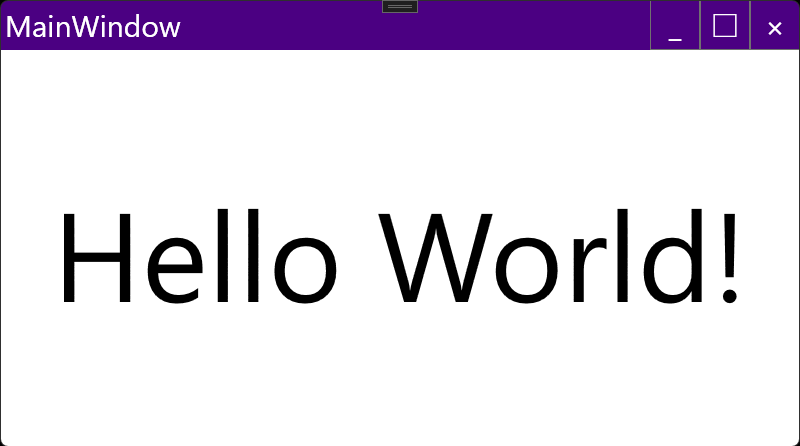

# CustomTitlebarWindow Class

assembly : EnkuToolkit.Wpf

namespace : EnkuToolkit.Wpf.Controls

## remarks

Window class with customizable titlebar

It has a Titlebar property of type FrameworkElement and

The content of the titlebar is written there.

The size of the titlebar depends on the Height property of the

object in the Titlebar property.

In addition, buttons and other objects in the titlebar are recognized as window movement areas as they are, and cannot be clicked or otherwise manipulated.

IsHitTestVisible property is attached to the TitlebarComponentsBehavior.

IsHitTestVisible property and set its value to true.

## example

MainWindow.xaml

```xaml
<et:CustomTitlebarWindow
        x:Class="MyApp.MainWindow"
        xmlns="http://schemas.microsoft.com/winfx/2006/xaml/presentation"
        xmlns:x="http://schemas.microsoft.com/winfx/2006/xaml"
        xmlns:d="http://schemas.microsoft.com/expression/blend/2008"
        xmlns:mc="http://schemas.openxmlformats.org/markup-compatibility/2006"
        xmlns:local="clr-namespace:MyApp"
        xmlns:et="https://github.com/StdEnku/EnkuToolkit/Wpf/Controls"
        mc:Ignorable="d"
        Title="MainWindow" Height="450" Width="800">

    <et:CustomTitlebarWindow.Titlebar>
        <Border Background="Indigo" Height="50">
            <UniformGrid Columns="2">
                <Label Foreground="White" FontSize="30" Content="{Binding RelativeSource={RelativeSource Mode=FindAncestor, AncestorType=Window}, Path=Title}" />

                <StackPanel Orientation="Horizontal" HorizontalAlignment="Right">
                    <StackPanel.Resources>
                        <Style TargetType="Button">
                            <Setter Property="Background" Value="Transparent" />
                            <Setter Property="Foreground" Value="White" />
                            <Setter Property="FontSize" Value="30" />
                            <Setter Property="Width" Value="50" />
                            <Setter Property="et:TitlebarComponentsBehavior.IsHitTestVisible" Value="True" />
                        </Style>
                    </StackPanel.Resources>

                    <Button Content="_" Click="MinimizeButtonClicked" />
                    <Button Content="□" Click="MaximizeButtonClicked" />
                    <Button Content="×" Click="ShutdownButtonClicked" />
                </StackPanel>
            </UniformGrid>
        </Border>
    </et:CustomTitlebarWindow.Titlebar>

    <Viewbox>
        <Label Content="Hello World!" />
    </Viewbox>
</et:CustomTitlebarWindow>
```


MainWindow.xaml.cs

```csharp
namespace MyApp;

using EnkuToolkit.Wpf.Controls;
using System.Windows;

public partial class MainWindow : CustomTitlebarWindow
{
    public MainWindow()
    {
        InitializeComponent();
    }

    private void ShutdownButtonClicked(object sender, RoutedEventArgs e)
    {
        App.Current.Shutdown();
    }

    private void MinimizeButtonClicked(object sender, RoutedEventArgs e)
    {
        this.WindowState = WindowState.Minimized;
    }

    private void MaximizeButtonClicked(object sender, RoutedEventArgs e)
    {
        var nextState = this.WindowState == WindowState.Maximized ? WindowState.Normal : WindowState.Maximized;
        this.WindowState = nextState;
    }
}
```



