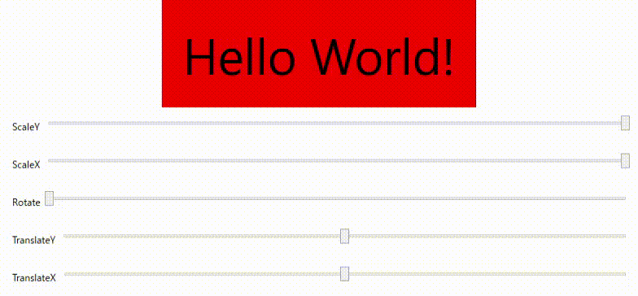

# NormalizedTransformContentControl クラス

アセンブリ : EnkuToolkit.Wpf

名前空間 : EnkuToolkit.Wpf.Controls

## 概要

下記五つの変形用プロパティを0~1の値で操作可能にした[TransformContentControl](./TransformContentControl-jp.md)クラス。

尚TranslateXでの移動距離は本オブジェクトのActualWidthに依存し、

TranslateYでの移動距離は本オブジェクトのActualHeightに依存します。


- TranslateX - 横方向への移動用プロパティ
- TranslateY - 縦方向への移動用プロパティ
- RotateAngle - 回転角指定用プロパティ
- ScaleX - 縦方向のサイズの倍率
- ScaleY - 横方向のサイズの倍率

## 使用例

MainWindow.xaml

```xaml
<Window
        x:Class="MyApp.MainWindow"
        xmlns="http://schemas.microsoft.com/winfx/2006/xaml/presentation"
        xmlns:x="http://schemas.microsoft.com/winfx/2006/xaml"
        xmlns:d="http://schemas.microsoft.com/expression/blend/2008"
        xmlns:mc="http://schemas.openxmlformats.org/markup-compatibility/2006"
        xmlns:local="clr-namespace:MyApp"
        xmlns:et="https://github.com/StdEnku/EnkuToolkit/Wpf/Controls"
        mc:Ignorable="d"
        Title="MainWindow" 
        Height="400" Width="800">


    <DockPanel LastChildFill="True">
        <DockPanel DockPanel.Dock="Bottom" LastChildFill="True" Margin="10">
            <Label Content="TranslateX" />
            <Slider Name="TranslateX" Minimum="-1" Maximum="1" Value="0" />
        </DockPanel>

        <DockPanel DockPanel.Dock="Bottom" LastChildFill="True" Margin="10">
            <Label Content="TranslateY" />
            <Slider Name="TranslateY" Minimum="-1" Maximum="1" Value="0" />
        </DockPanel>

        <DockPanel DockPanel.Dock="Bottom" LastChildFill="True"  Margin="10">
            <Label Content="Rotate" />
            <Slider Name="Rotate" Minimum="0" Maximum="1" />
        </DockPanel>

        <DockPanel DockPanel.Dock="Bottom" LastChildFill="True"  Margin="10">
            <Label Content="ScaleX" />
            <Slider Name="ScaleX" Minimum="0" Maximum="1" Value="1" />
        </DockPanel>

        <DockPanel DockPanel.Dock="Bottom" LastChildFill="True"  Margin="10">
            <Label Content="ScaleY" />
            <Slider Name="ScaleY" Minimum="0" Maximum="1" Value="1" />
        </DockPanel>

        <et:NormalizedTransformContentControl 
            DockPanel.Dock="Top" 
            TranslateX="{Binding ElementName=TranslateX, Path=Value}"
            TranslateY="{Binding ElementName=TranslateY, Path=Value}"
            RotateAngle="{Binding ElementName=Rotate, Path=Value}"
            ScaleX="{Binding ElementName=ScaleX, Path=Value}" 
            ScaleY="{Binding ElementName=ScaleY, Path=Value}" >

            <Viewbox>
                <Label Content="Hello World!" 
                       Background="Red" />
            </Viewbox>
            
        </et:NormalizedTransformContentControl>
    </DockPanel>
</Window>
```

